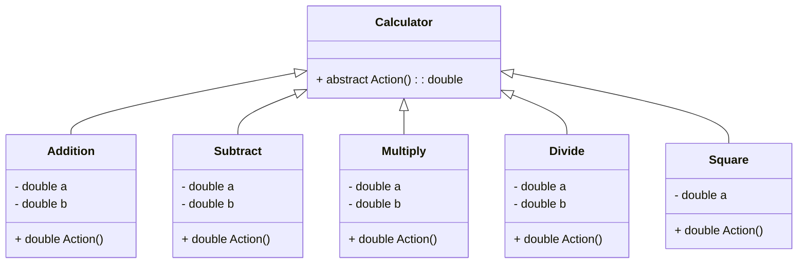

```mermaid
classDiagram
    class Calculator {
        + abstract Action(): double
    }
    class Addition {
        - double a
        - double b
        + double Action()
    }
    class Subtract {
        - double a
        - double b
        + double Action()
    }
    class Multiply {
        - double a
        - double b
        + double Action()
    }
    class Divide {
        - double a
        - double b
        + double Action()
    }
    class Square {
        - double a
        + double Action()
    }

    Calculator <|-- Addition
    Calculator <|-- Subtract
    Calculator <|-- Multiply
    Calculator <|-- Divide
    Calculator <|-- Square
```
